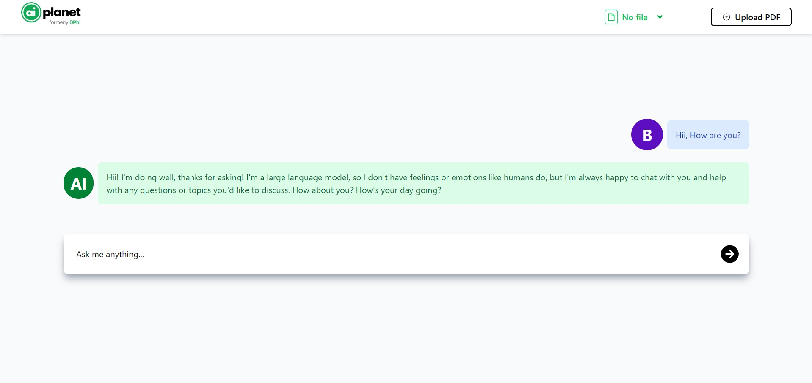

# MyChatBot

MyChatBot is an AI-powered chatbot platform that allows users to interact with an LLM (Large Language Model) for both general conversation and document-based question answering. Users can upload PDF files, embed them for retrieval-augmented QA, and chat with the bot about both general and document-specific topics.


---

## Features

### General Features

- **Conversational AI:** Chat with an LLM for general queries.
- **Document QA:** Upload PDF files and ask questions about their content.
- **PDF Upload & Embedding:** Upload PDF files, which are processed and embedded for semantic search.
- **File Management:** View and select from previously uploaded files.
- **Chat History:** Maintains chat history for context-aware responses.
- **Responsive UI:** Modern, responsive frontend built with React, TailwindCSS, and Vite.
- **Markdown Support:** AI responses support Markdown formatting.

---

## Project Structure

```
MyChatBot/
├── backend/      # FastAPI backend (see below for setup)
├── frontend/     # React frontend (see below for setup)
```

---

## Frontend

### Tech Stack

- **React 19**
- **Vite**
- **TailwindCSS**
- **React Router**
- **React Markdown**
- **Axios**
- **ESLint**

### Setup Instructions

1. **Install dependencies:**
   ```sh
   cd frontend
   npm install
   ```

2. **Start the development server:**
   ```sh
   npm run dev
   ```
   The app will be available at [http://localhost:5173](http://localhost:5173).

3. **Build for production:**
   ```sh
   npm run build
   ```

4. **Lint the code:**
   ```sh
   npm run lint
   ```

### Usage

- Upload PDF files using the navbar.
- Select a file from the dropdown to embed it for QA.
- Ask questions in the chat window—either general or about the uploaded document.
- The bot will respond contextually, using the selected document if relevant.

---

## Backend

### Tech Stack

- **FastAPI**
- **SQLAlchemy (PostgreSQL)**
- **LangChain**
- **Chroma Vector Store**
- **HuggingFace Embeddings**
- **Groq LLM API**
- **CORS Middleware**

### Setup Instructions

1. **Clone the repository and navigate to the backend directory.**

2. **Install dependencies:**
   ```sh
   pip install -r requirements.txt
   ```

3. **Set up environment variables:**
   Create a `.env` file with the following keys:
   ```
   GROQ_API_KEY=your_groq_api_key
   USER=your_postgres_user
   PASSWORD=your_postgres_password
   HOST=your_postgres_host
   PORT=your_postgres_port
   DB=your_postgres_db
   ```

4. **Run the backend server:**
   ```sh
   uvicorn main:app --reload --host localhost --port 8000
   ```

### API Endpoints

- `POST /upload/` — Upload a PDF file.
- `POST /embed_file/` — Embed a selected PDF for QA.
- `POST /upload_info/` — Store file metadata in the database.
- `GET /get-all-files` — List all uploaded files.
- `POST /generate` — Generate a response (general or document QA).
- `GET /refresh` — Clear chat history.

---

## How It Works

- **PDF Upload:** Users upload PDF files, which are stored and processed on the backend.
- **Embedding:** The backend uses LangChain and HuggingFace embeddings to create a vector store for semantic search.
- **Retrieval QA:** When a user asks a question related to the document, the backend retrieves relevant chunks and uses the Groq LLM to answer.
- **General Chat:** For non-document queries, the LLM responds conversationally.
- **Chat Routing:** The backend routes queries to either document QA or general chat based on keywords.

---

## Example Workflow

1. **Upload a PDF** via the frontend.
2. **Select the file** from the dropdown to embed it.
3. **Ask questions** about the document or general topics.
4. **Receive answers** from the AI, with Markdown formatting.

---

## Requirements

- Node.js (for frontend)
- Python 3.9+ (for backend)
- PostgreSQL database
- Groq API key

---

## License

This project is for educational and research purposes.

---

## Acknowledgements

- [LangChain](https://github.com/langchain-ai/langchain)
- [Groq](https://groq.com/)
- [HuggingFace](https://huggingface.co/)
- [Chroma](https://www.trychroma.com/)
- [React](https://react.dev/)
- [Vite](https://vitejs.dev/)
- [TailwindCSS](https://tailwindcss.com/)

---

## Contact

For questions or contributions, please open an issue or contact the maintainer.
